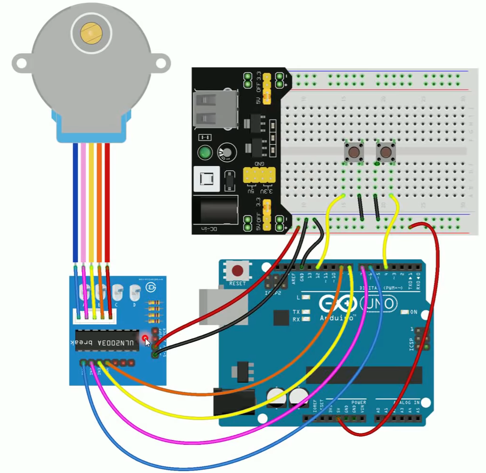

Author: Andre Lumesi
Adapted from example: BrincandoComIdeias, Using the stepper motor
LINK do exemplo original:    https://www.youtube.com/brincandocomideias ; https://cursodearduino.net/
DATA:    04/09/2022
Changes: Removal of pushbuttons and control via keyboard g and c keys.

## Hardware Required

* an Arduino board
* Stepper Motor
* Uln 2003 Driver
* hook-up wires

## Circuit

